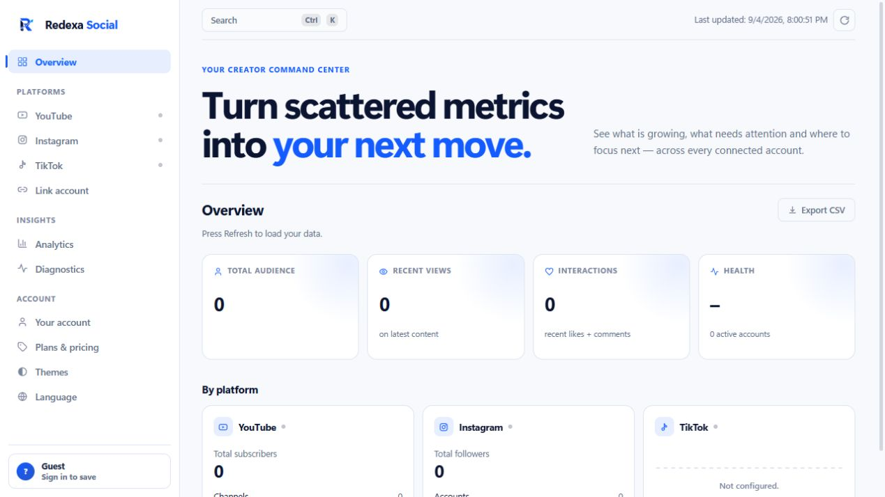

# Redexa Social

Private creator analytics for Windows.

[Download the latest signed release](https://github.com/AurelioAvila/redexa-social/releases/latest) · [Official website](https://redexa.getcertsprint.com) · [Getting started](https://redexa.getcertsprint.com/getting-started)



This repository hosts Windows downloads, release notes, public documentation and the release verification tools. Application development continues in a private repository. Existing source snapshots remain available in historical branches, tags and forks; future application source is not published here.

Official updates use signed manifests and Windows binaries signed by Aurelio Avila. Download through the official website, this repository or WinGet:

```powershell
winget install --id AurelioAvila.SocialDashboard --exact
```

For private support or billing questions, email [redexasocial@getcertsprint.com](mailto:redexasocial@getcertsprint.com) or use **Help & support** inside the app. For a reproducible, non-sensitive bug, [open an issue](https://github.com/AurelioAvila/redexa-social/issues). Never include passwords, access tokens or private analytics in public issues.

See [privacy](https://redexa.getcertsprint.com/privacy), [plans](https://redexa.getcertsprint.com/pricing) and [license](LICENSE).
